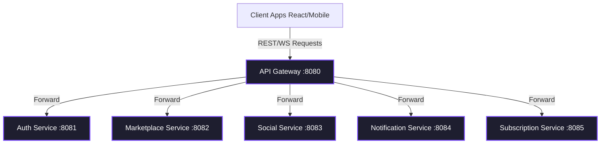

# HustleUp Platform API Documentation

Welcome to the **HustleUp Platform API Documentation**. HustleUp is a modern microservices-based social and marketplace platform designed for entrepreneurs, freelancers, and hustlers.

This document serves as the comprehensive reference for all backend services, API endpoints, authentication flows, and real-time communication protocols.

---

## 🏗️ Architectural Overview

The HustleUp backend is composed of five distinct microservices coordinated through an **API Gateway** and secured using stateless **JSON Web Tokens (JWT)**.



### Base Addresses
* **Gateway Entry Point:** `http://localhost:8080` (All client requests route through here)
* **Auth Service Ports:** Port `8081` internally (`/api/v1/auth`, `/api/v1/users`)
* **Marketplace Service Port:** Port `8082` internally (`/api/v1/listings`, `/api/v1/bookings`, `/api/v1/reviews`)
* **Social Service Port:** Port `8083` internally (`/api/v1/feed`, `/api/v1/stories`, `/api/v1/follows`, `/api/v1/dating`)
* **Notification/Messaging Service Port:** Port `8084` internally (`/api/v1/notifications`, `/api/v1/direct-messages`, `/ws`)
* **Subscription Service Port:** Port `8085` internally (`/api/v1/subscriptions`, `/api/payments`)

---

## 🔒 Authentication Flow (JWT)

HustleUp uses a **stateless, two-token (Access + Refresh)** authentication mechanism.

> [!NOTE]
> * **Access Tokens:** Short-lived tokens sent in the `Authorization: Bearer <accessToken>` header.
> * **Refresh Tokens:** Long-lived tokens (7 days) used to retrieve new access tokens without requiring credentials.

### Authentication Headers
For all endpoints requiring authentication, pass the access token as follows:
```http
Authorization: Bearer <your_access_token>
```

---

## 📂 Service Endpoints Reference

### 1. 🔑 Authentication & Profile Service
* **Base Path:** `/api/v1/auth` and `/api/v1/users`

#### Auth Endpoints (`/api/v1/auth`)

| Method | Endpoint | Auth | Description | Payload / Parameters |
| :--- | :--- | :--- | :--- | :--- |
| `POST` | `/register` | No | Register a new user account. | `RegisterRequest` (JSON) |
| `POST` | `/login` | No | Authenticate user and issue tokens. | `LoginRequest` (JSON) |
| `POST` | `/refresh` | No | Exchange refresh token for new access token. | `RefreshRequest` (JSON) |
| `GET` | `/me` | **Yes** | Retrieve currently logged-in user profile. | Header Bearer Token |

#### Users Profile Endpoints (`/api/v1/users`)

| Method | Endpoint | Auth | Description | Payload / Parameters |
| :--- | :--- | :--- | :--- | :--- |
| `GET` | `/` | **Yes** | Retrieve all registered users. | None |
| `GET` | `/{id}/profile` | No | Fetch public profile & record view if authenticated viewer. | `{id}` (UUID Path Variable) |
| `GET` | `/me/viewers` | **Yes** | Retrieve list of users who recently viewed your profile. | None |
| `PATCH` | `/me` | **Yes** | Partially update authenticated user's profile. | `UserDto` (JSON, partial fields) |
| `PATCH` | `/me/avatar` | **Yes** | Upload and update profile avatar. | `MultipartFile` named `file` |
| `PATCH` | `/me/banner` | **Yes** | Upload and update shop banner. | `MultipartFile` named `file` |

#### Payload Examples
##### `POST /api/v1/auth/register` Request:
```json
{
  "email": "hustler@example.com",
  "password": "SecurePassword123",
  "fullName": "John Doe",
  "phone": "+1234567890",
  "role": "SELLER" // Can be BUYER or SELLER
}
```

##### `POST /api/v1/auth/login` Request:
```json
{
  "email": "hustler@example.com",
  "password": "SecurePassword123"
}
```

##### Auth Success Response (200 OK):
```json
{
  "accessToken": "eyJhbGciOiJIUzI1NiJ9...",
  "refreshToken": "eyJhbGciOiJIUzI1NiJ9...",
  "tokenType": "Bearer",
  "role": "SELLER",
  "fullName": "John Doe",
  "userId": "d3b07384-d113-4956-9b1e-2c7b50f7ff3b",
  "avatarUrl": "http://localhost:8081/storage/avatar.png"
}
```

---

### 2. 🛒 Marketplace Service
* **Base Path:** `/api/v1/listings`, `/api/v1/bookings`, and `/api/v1/reviews`

#### Listings Endpoints (`/api/v1/listings`)

| Method | Endpoint | Auth | Description | Payload / Parameters |
| :--- | :--- | :--- | :--- | :--- |
| `GET` | `/` | No | Browse marketplace listings with optional filters. | Query params: `q`, `type` (PRODUCT/SERVICE/RENTAL/JOB), `city`, `maxPrice`, `negotiable`, `sort` |
| `GET` | `/recommended` | No | Retrieve recommended listings. | None |
| `GET` | `/{id}` | No | Fetch details of a single listing. | `{id}` (UUID Path Variable) |
| `GET` | `/user/{userId}` | No | Fetch all listings created by a specific user. | `{userId}` (UUID Path Variable) |
| `GET` | `/my` | **Yes (Seller)** | Fetch listings created by currently logged-in seller. | None |
| `POST` | `/` | **Yes** | Create a new listing. | `multipart/form-data` params (see details below) |
| `PATCH` | `/{id}` | **Yes (Seller)** | Update a listing. | Query parameters (see details below) |
| `DELETE` | `/{id}` | **Yes (Seller)** | Delete a listing. | `{id}` (UUID Path Variable) |

* **POST `/api/v1/listings` Form Data parameters:**
  * `title` (String, required)
  * `description` (String, optional)
  * `listingType` (String, required: `PRODUCT`, `SERVICE`, `RENTAL`, `JOB`)
  * `price` (BigDecimal, required)
  * `currency` (String, optional, default USD)
  * `negotiable` (boolean, optional, default false)
  * `city` (String, optional)
  * `agentFee` (boolean, optional, default false)
  * `meta` (String, JSON structure for specific listing types)
  * `images` (List of MultipartFile, optional)

* **PATCH `/api/v1/listings/{id}` parameters (sent as query params):**
  * `title`, `description`, `price`, `negotiable`, `city`, `meta`, `status` (ACTIVE, DRAFT, SOLD)

---

#### Bookings Endpoints (`/api/v1/bookings`)
The booking lifecycle flow: `INQUIRED` ➔ `NEGOTIATING` ➔ `BOOKED` ➔ `COMPLETED` (or `CANCELLED` at any point).

| Method | Endpoint | Auth | Description | Payload / Parameters |
| :--- | :--- | :--- | :--- | :--- |
| `POST` | `/` | **Yes** | Open a booking inquiry. | `{"listingId": "...", "offeredPrice": 10.0, "scheduledAt": "ISO-Date"}` |
| `PATCH` | `/{id}/counter` | **Yes (Seller)** | Propose a counter-offer on booking. | `{"counterPrice": 12.0}` |
| `PATCH` | `/{id}/accept` | **Yes** | Accept the current offer/counter-offer. | None |
| `PATCH` | `/{id}/complete` | **Yes (Seller)** | Mark booking completed (delivers work). | None |
| `PATCH` | `/{id}/cancel` | **Yes** | Cancel booking with optional reason. | `{"reason": "Scheduling conflict"}` |
| `GET` | `/my` | **Yes** | Fetch booking history (as buyer and seller). | None |

---

#### Reviews Endpoints (`/api/v1/reviews`)

| Method | Endpoint | Auth | Description | Payload / Parameters |
| :--- | :--- | :--- | :--- | :--- |
| `POST` | `/` | **Yes** | Review a completed transaction. | `{"bookingId": "...", "rating": 5, "comment": "..."}` |
| `GET` | `/user/{userId}` | No | Fetch received reviews for a user. | `{userId}` (UUID Path Variable) |

---

### 3. 👥 Social Service
* **Base Path:** `/api/v1/feed`, `/api/v1/stories`, `/api/v1/follows`, and `/api/v1/dating`

#### Feed Endpoints (`/api/v1/feed`)

| Method | Endpoint | Auth | Description | Payload / Parameters |
| :--- | :--- | :--- | :--- | :--- |
| `GET` | `/` | No | Fetch feed posts. | Query params: `sort=latest\|trending\|popular\|recommended` |
| `POST` | `/` | **Yes** | Create a new feed post. | `multipart/form-data` params (see details below) |
| `GET` | `/{postId}/comments` | No | Fetch post comments. | `{postId}` (UUID Path Variable) |
| `POST` | `/{postId}/comments`| **Yes** | Post a new comment or reply. | `{"content": "...", "parentId": "..."}` |
| `POST` | `/{postId}/likes` | **Yes** | Like a post. | `{postId}` (UUID Path Variable) |
| `DELETE`| `/{postId}/likes` | **Yes** | Unlike a post. | `{postId}` (UUID Path Variable) |

* **POST `/api/v1/feed` parameters (multipart/form-data):**
  * `content` (String, required)
  * `authorName` (String, optional)
  * `anonymous` (boolean, optional, default false)
  * `media` (MultipartFile, optional)

---

#### Ephemeral Stories Endpoints (`/api/v1/stories`)
Stories last 24 hours and have view tracking.

| Method | Endpoint | Auth | Description | Payload / Parameters |
| :--- | :--- | :--- | :--- | :--- |
| `GET` | `/` | No | Fetch active stories. | None |
| `POST` | `/` | **Yes** | Create a new story. | `multipart/form-data` params (see details below) |
| `POST` | `/{id}/likes` | **Yes** | Like a story. | `{id}` (UUID Path Variable) |
| `DELETE`| `/{id}/likes` | **Yes** | Unlike a story. | `{id}` (UUID Path Variable) |
| `POST` | `/{id}/views` | **Yes** | Record a story view. | `{id}` (UUID Path Variable) |
| `DELETE`| `/{id}` | **Yes (Author)**| Delete a story. | `{id}` (UUID Path Variable) |

* **POST `/api/v1/stories` parameters (multipart/form-data):**
  * `type` (String, required: `TEXT`, `IMAGE`, `VIDEO`)
  * `content` (String, required only if `type` is `TEXT`)
  * `media` (MultipartFile, required only if `type` is `IMAGE` or `VIDEO`)

---

#### User Follows Endpoints (`/api/v1/follows`)

| Method | Endpoint | Auth | Description | Payload / Parameters |
| :--- | :--- | :--- | :--- | :--- |
| `GET` | `/followers` | **Yes** | Fetch my followers. | None |
| `GET` | `/following` | **Yes** | Fetch users I follow. | None |
| `POST` | `/{targetId}` | **Yes** | Follow a user. | `{targetId}` (UUID Path Variable) |
| `DELETE`| `/{targetId}` | **Yes** | Unfollow a user. | `{targetId}` (UUID Path Variable) |
| `GET` | `/{userId}/counts` | No | Get followers/following counts. | `{userId}` (UUID Path Variable) |
| `GET` | `/{userId}/is-following`| **Yes**| Check if current user follows target. | `{userId}` (UUID Path Variable) |

---

#### Swipe Dating / Networking Endpoints (`/api/v1/dating`)

| Method | Endpoint | Auth | Description | Payload / Parameters |
| :--- | :--- | :--- | :--- | :--- |
| `GET` | `/profiles` | No | Fetch swipe candidates (excludes current user). | None |
| `GET` | `/profile/me` | **Yes** | Fetch currently logged-in user's dating profile. | None |
| `POST` | `/profile` | **Yes** | Upsert user's dating profile details. | `multipart/form-data` (see details below) |
| `POST` | `/like/{profileId}`| **Yes**| Swipe Right on a profile (stub). | `{profileId}` (UUID Path Variable) |
| `POST` | `/pass/{profileId}`| **Yes**| Swipe Left on a profile (stub). | `{profileId}` (UUID Path Variable) |

* **POST `/api/v1/dating/profile` parameters (multipart/form-data):**
  * `bio` (String), `age` (Integer), `location` (String), `lookingFor` (String), `interests` (String), `gender` (String)
  * `image` (MultipartFile, optional)

---

### 4. 🔔 Notification & Real-Time Messaging Service
* **Base Path:** `/api/v1/notifications` and `/api/v1/direct-messages`

#### In-App Alerts (`/api/v1/notifications`)

| Method | Endpoint | Auth | Description | Payload / Parameters |
| :--- | :--- | :--- | :--- | :--- |
| `GET` | `/` | **Yes** | Fetch user's notification list. | None |
| `GET` | `/unread-count` | **Yes** | Fetch unread count for badge indicators. | None |
| `PATCH` | `/read-all` | **Yes** | Mark all notifications as read. | None |
| `PATCH` | `/{id}/read` | **Yes** | Mark a specific notification as read. | `{id}` (UUID Path Variable) |

#### Direct Messaging (`/api/v1/direct-messages`)

| Method | Endpoint | Auth | Description | Payload / Parameters |
| :--- | :--- | :--- | :--- | :--- |
| `GET` | `/partners` | **Yes** | Retrieve chat inbox list (sorted by latest activity). | None |
| `GET` | `/{partnerId}` | **Yes** | Fetch message history with a partner. | `{partnerId}` (UUID Path Variable) |
| `POST` | `/{partnerId}` | **Yes** | Send direct message (also creates notification). | `{"content": "..."}` |

---

#### 💬 Real-Time Booking Chat (STOMP WebSocket)
Used for real-time interaction scoped inside bookings.

> [!IMPORTANT]
> * **WebSocket Connection Handshake URL:** `ws://localhost:8080/ws` or `ws://localhost:8084/ws`
> * **Subscribe Destination (Inbound):** `/topic/booking/{bookingId}`
> * **Publish Destination (Outbound):** `/app/chat.send/{bookingId}`

##### WebSocket Outbound Message Body Format:
```json
{
  "senderId": "d3b07384-d113-4956-9b1e-2c7b50f7ff3b",
  "content": "Hello, I started working on your design!",
  "messageType": "TEXT" // Can be TEXT, IMAGE, FILE
}
```

##### Booking Chat REST History Endpoint:

| Method | Endpoint | Auth | Description | Payload / Parameters |
| :--- | :--- | :--- | :--- | :--- |
| `GET` | `/api/v1/messages/{bookingId}` | **Yes** | Fetch chronological chat history for booking. | `{bookingId}` (UUID Path Variable) |

---

### 5. 💳 Subscriptions & Payments Service
* **Base Path:** `/api/v1/subscriptions` and `/api/payments`

#### Subscription Endpoints (`/api/v1/subscriptions`)

| Method | Endpoint | Auth | Description | Payload / Parameters |
| :--- | :--- | :--- | :--- | :--- |
| `GET` | `/my` | **Yes (Seller)** | Get seller's subscription plan. | None |
| `POST` | `/upgrade` | **Yes (Seller)** | Direct upgrade to VERIFIED plan (Testing). | None |

#### Stripe Payments Endpoints (`/api/payments`)

| Method | Endpoint | Auth | Description | Payload / Parameters |
| :--- | :--- | :--- | :--- | :--- |
| `POST` | `/create-checkout-session` | **Yes** | Create checkout session and return Stripe URL. | `{"email": "...", "priceId": "..."}` |
| `POST` | `/webhook` | No | Stripe automated webhook listener. | Raw Stripe Event JSON + `Stripe-Signature` Header |

##### `POST /api/payments/create-checkout-session` Response Example:
```json
{
  "url": "https://checkout.stripe.com/c/pay/cs_test_a1b2c3d4..."
}
```

---

## 🛠️ Error Response Format

Errors are standard across the entire platform. Whenever a client request fails, the API returns an appropriate HTTP status code paired with a JSON object detailing the error:

```json
{
  "message": "Error details and description"
}
```

For custom validations, the payload returns:
```json
{
  "error": "Error details"
}
```

---

*HustleUp Social and Marketplace API Reference © 2026. All rights reserved.*
