# HustleUp — Software Requirements Specification

**Document type:** Software Requirements Specification (SRS) with use-case, activity and test-case models
**System:** HustleUp — social marketplace platform
**Version:** 1.0 · 13 August 2026

---

## Table of contents

1. [Abstract](#1-abstract)
2. [Document scope](#2-document-scope)
3. [System overview](#3-system-overview)
4. [Actors](#4-actors)
5. [Use case diagram](#5-use-case-diagram)
6. [Functional requirements](#6-functional-requirements)
7. [Non-functional requirements](#7-non-functional-requirements)
8. [Detailed use cases](#8-detailed-use-cases)
9. [Activity diagrams](#9-activity-diagrams)
10. [Domain state models](#10-domain-state-models)
11. [Test cases](#11-test-cases)
12. [Traceability matrix](#12-traceability-matrix)
13. [Glossary](#13-glossary)

---

## 1. Abstract

HustleUp is a social marketplace platform for independent sellers — hairstylists, caterers, event
organisers, fashion makers, tutors and other small operators — built around the observation that
for this class of seller, **the transaction is inseparable from the relationship**. A generic
marketplace treats a listing as a product with a fixed price and a checkout button. Real trade at
this scale involves asking whether a slot is free, agreeing a price that isn't the asking price,
and buying from someone you already follow.

The system therefore merges three product categories that are usually built separately:

- **A marketplace** — eight listing types spanning services, goods, events, rentals and jobs, each
  reaching a booking through negotiation rather than a fixed-price cart alone.
- **A social network** — a post feed, ephemeral stories, follows, profiles and a seller
  leaderboard, so discovery happens through people rather than only through search.
- **A messaging layer** — real-time direct messages and per-booking negotiation threads, which is
  where price is actually agreed.

Two features sit deliberately across those boundaries. **Hustle Bond** is a premium swipe-based
matching deck for connecting with other creatives, whose matches become conversations in the same
inbox as marketplace threads. **Swaps** let two sellers trade listings directly with no money
involved, forming public swap chains.

The platform is implemented as five Spring Boot microservices behind a Spring Cloud Gateway, sharing
a common library, with a React single-page web client and an Expo React Native mobile client.
Payments run through Stripe (Checkout for buyers, Connect for seller payouts); media is stored on S3
or local disk; search is served by Algolia.

This document specifies what the system does (§6), the qualities it must exhibit while doing it
(§7), the scenarios through which users reach those outcomes (§8–§9), and the tests that
demonstrate the requirements are met (§11).

---

## 2. Document scope

This SRS describes **requirements and behaviour**. Two sibling documents cover adjacent ground and
are not repeated here:

| Document | Covers |
|---|---|
| `API_DOCUMENTATION.md` | Endpoint-by-endpoint HTTP reference, request/response payloads, WebSocket protocol |
| `INTEGRATIONS.md` | Setup instructions for Stripe, Resend, OAuth providers, Sentry, Algolia, S3, Turnstile |
| **`SRS.md`** (this file) | Abstract, actors, functional and non-functional requirements, use cases, activity diagrams, test cases, traceability |

**Out of scope:** deployment topology, infrastructure-as-code, database migration procedure, and
commercial terms.

---

## 3. System overview

### 3.1 Architecture

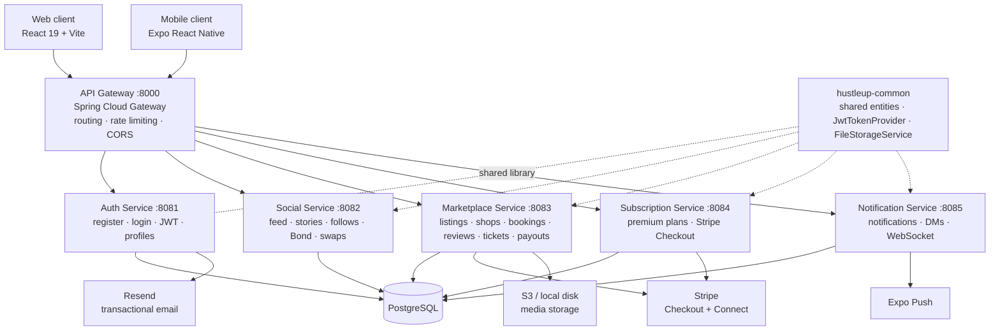

Every service validates JWTs independently against a shared `JWT_SECRET` via
`JwtTokenProvider`; there is no session store and no per-service auth call.

### 3.2 Technology stack

| Layer | Technology |
|---|---|
| Backend | Java 21, Spring Boot 3.4, Spring Security, Spring Data JPA, Spring Cloud Gateway |
| Persistence | PostgreSQL, Hibernate (`ddl-auto: update`) |
| Auth | JJWT — stateless access + refresh tokens |
| Web client | React 19, Vite 8, Redux Toolkit, React Router 7, Tailwind CSS 4, Framer Motion 12 |
| Mobile client | Expo, React Native |
| Real time | STOMP over SockJS/WebSocket |
| Payments | Stripe Java SDK — Checkout Sessions, Connect Express payouts |
| Media | AWS S3 SDK, with local-disk fallback |
| Search | Algolia |
| Email | Resend |
| Monitoring | Sentry (backend and frontend) |
| Bot protection | Cloudflare Turnstile |

### 3.3 Module inventory

| Module | Domain entities |
|---|---|
| Auth | `User`, `AuthToken`, `RefreshToken`, `Role` |
| Marketplace | `Listing`, `ListingType`, `ListingStatus`, `SavedListing`, `Shop`, `ShopProduct`, `Booking`, `BookingStatus`, `Availability`, `Review`, `EventTicket`, `TicketStatus`, `SellerPayoutAccount` |
| Social | `Post`, `PostLike`, `SavedPost`, `Comment`, `Story`, `StoryLike`, `StoryView`, `Follow`, `UserBlock`, `UserReport`, `ProfileView`, `DatingProfile`, `DatingSwipe`, `Match`, `SwapOffer`, `SwapStatus` |
| Notification | `Notification`, `DirectMessage`, `ChatMessage`, `ChatStreak` |
| Subscription | `Subscription` |

---

## 4. Actors

| ID | Actor | Description |
|---|---|---|
| **A1** | **Guest** | Unauthenticated visitor. May browse listings, shops, creator profiles, the public feed and the leaderboard. Cannot transact or message. |
| **A2** | **Buyer** | Registered user (`Role.BUYER`). Books services, buys goods, holds event tickets, messages sellers, posts to the feed, follows others. |
| **A3** | **Seller** | Registered user (`Role.SELLER`). All buyer abilities, plus creating listings, running a shop, publishing availability, negotiating and completing bookings, receiving payouts, scanning tickets at their events. |
| **A4** | **Premium member** | Buyer or seller with an active `VERIFIED` subscription. Adds access to Hustle Bond. |
| **A5** | **Administrator** | `Role.ADMIN`. Reviews user reports, moderates content and accounts. |
| **A6** | **Payment provider** *(external)* | Stripe. Hosts checkout, holds seller payout accounts, notifies the platform via webhooks. |
| **A7** | **Notification transport** *(external)* | Expo Push, mirroring in-app notifications to mobile devices. |
| **A8** | **Identity provider** *(external)* | Google and Facebook OAuth. |
| **A9** | **Email service** *(external)* | Resend, delivering verification and password-reset mail. |

Actors A2–A5 are cumulative: each inherits everything the actors above it can do.

---

## 5. Use case diagram

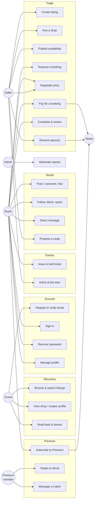

---

## 6. Functional requirements

Priority: **M** = must have (system is not viable without it), **S** = should have, **C** = could have.

### 6.1 Authentication and account management — `FR-AUTH`

| ID | Requirement | Pri |
|---|---|---|
| FR-AUTH-01 | The system shall let a visitor register with full name, email, password and role (buyer or seller). | M |
| FR-AUTH-02 | The system shall store passwords only as BCrypt hashes and shall never return a password hash in any API response. | M |
| FR-AUTH-03 | The system shall send an email verification link on registration and mark the account verified when the link is followed. | M |
| FR-AUTH-04 | The system shall authenticate a user by email and password, issuing a short-lived access token and a long-lived refresh token. | M |
| FR-AUTH-05 | The system shall let a user sign in with a Google or Facebook account, verifying the supplied OAuth access token against the provider's own userinfo endpoint rather than trusting a client-supplied identity. | S |
| FR-AUTH-06 | The system shall exchange a valid refresh token for a new access token without re-prompting for credentials, exactly once per failed request. | M |
| FR-AUTH-07 | The system shall let a user request a password-reset link by email and set a new password with a single-use token. | M |
| FR-AUTH-08 | The system shall protect registration and login against automated abuse using a bot-protection challenge. | S |
| FR-AUTH-09 | On sign-out, or when a session cannot be refreshed, the system shall clear **all** client-side session state — access token, refresh token, cached user, shopping cart and saved-listing cache — so that no state carries into the next session on that device. | M |
| FR-AUTH-10 | The system shall let an authenticated user retrieve and update their own profile, including avatar, bio, city and push-notification token. | M |

### 6.2 Listings and shops — `FR-LIST`

| ID | Requirement | Pri |
|---|---|---|
| FR-LIST-01 | The system shall let a seller publish a listing of one of eight types: `HAIR_BEAUTY`, `FOOD`, `EVENT`, `FASHION`, `GOODS`, `SKILL`, `JOB`, `RENTAL`. | M |
| FR-LIST-02 | The system shall accept image and video uploads against a listing and serve them from configured storage. | M |
| FR-LIST-03 | The system shall let anyone, including guests, browse and filter listings by type, price, location and free-text query. | M |
| FR-LIST-04 | The system shall provide a personalised recommended-listings view to authenticated users. | S |
| FR-LIST-05 | The system shall let a listing carry a status of `ACTIVE`, `PAUSED`, `SOLD_OUT` or `DELETED`, and shall exclude non-`ACTIVE` listings from browse results. | M |
| FR-LIST-06 | The system shall let an authenticated user save and unsave listings and retrieve their saved set. | S |
| FR-LIST-07 | The system shall let a seller create at most one shop storefront, with a banner, description and readable slug, addressable by either slug or UUID. | S |
| FR-LIST-08 | The system shall let a shop owner add, update and remove products within their own shop, and shall reject those operations from any other user. | S |
| FR-LIST-09 | The system shall let a seller publish bookable time slots against a listing, and let buyers see which remain open. | S |
| FR-LIST-10 | The system shall provide full-text search across listings, shops and creators. | S |

### 6.3 Bookings, negotiation and payment — `FR-BOOK`

| ID | Requirement | Pri |
|---|---|---|
| FR-BOOK-01 | The system shall let a buyer request a booking against a listing, optionally naming an offered price and a slot. | M |
| FR-BOOK-02 | The system shall model a booking through the states `POSTED → INQUIRED → NEGOTIATING → BOOKED → COMPLETED`, with `CANCELLED` reachable before completion. | M |
| FR-BOOK-03 | The system shall let either party issue a counter-offer, moving the booking to `NEGOTIATING` and recording the proposed price. | M |
| FR-BOOK-04 | The system shall let the counterparty accept the standing offer, moving the booking to `BOOKED` at the agreed price. | M |
| FR-BOOK-05 | The system shall let either party cancel a booking before completion, recording a reason. | M |
| FR-BOOK-06 | The system shall let the seller mark a `BOOKED` booking `COMPLETED`. | M |
| FR-BOOK-07 | The system shall create a Stripe Checkout Session for a `BOOKED` booking and return its hosted URL to the buyer. | M |
| FR-BOOK-08 | The system shall reconcile payment outcomes from Stripe webhooks rather than trusting the client's return from the hosted page. | M |
| FR-BOOK-09 | The system shall let a seller onboard a payout account through Stripe Connect's hosted flow, and shall store only the resulting account status — never bank details. | M |
| FR-BOOK-10 | The system shall let a buyer leave a star rating and written review against a completed booking, and shall surface the aggregate on the seller's profile. | S |
| FR-BOOK-11 | The system shall maintain a client-side cart of listings with per-item quantity and negotiated price, persisted across page reloads within a session. | S |

### 6.4 Event ticketing — `FR-TICK`

| ID | Requirement | Pri |
|---|---|---|
| FR-TICK-01 | The system shall issue an event ticket automatically when a booking against an `EVENT` listing is confirmed, and shall provide no other route to obtaining one. | M |
| FR-TICK-02 | The system shall render each ticket as a scannable QR code carrying an opaque `HUTKT:` payload, plus a human-readable admission code for manual entry. | M |
| FR-TICK-03 | The system shall model a ticket as `VALID`, `CHECKED_IN` or `CANCELLED`. | M |
| FR-TICK-04 | The system shall let the event organiser scan or type a code at the door and shall report the outcome as an ordinary success response carrying an `admitted` flag, not as an HTTP error. | M |
| FR-TICK-05 | The system shall reject a second admission attempt for an already `CHECKED_IN` ticket. | M |
| FR-TICK-06 | The system shall restrict the organiser ticket list, door summary and scan endpoints to the owner of the event, returning 403 otherwise. | M |
| FR-TICK-07 | The system shall let an attendee self-admit, for events run without anyone on the door. | S |

### 6.5 Messaging — `FR-MSG`

| ID | Requirement | Pri |
|---|---|---|
| FR-MSG-01 | The system shall provide direct one-to-one messaging between any two registered users. | M |
| FR-MSG-02 | The system shall deliver messages in real time over WebSocket while a conversation is open, and shall fall back to polling. | M |
| FR-MSG-03 | The system shall support text, image, sticker, shared-listing and shared-post message types, each with a distinct preview in the conversation list. | S |
| FR-MSG-04 | The system shall mark a conversation read when it is opened, and shall expose per-conversation and total unread counts. | M |
| FR-MSG-05 | The system shall maintain a per-pair messaging streak, incrementing on consecutive days and resetting after a gap of more than one day. | C |
| FR-MSG-06 | The system shall list conversation partners ordered by most recent message. | M |
| FR-MSG-07 | The system shall include every Bond match in the conversation list from the moment the match is made, before any message exists, ordered after messaged conversations and among themselves by match recency. | M |
| FR-MSG-08 | The system shall visually distinguish a conversation originating from a Bond match from a marketplace conversation. | S |
| FR-MSG-09 | The system shall provide a per-booking negotiation thread separate from direct messages. | M |

### 6.6 Social — `FR-SOC`

| ID | Requirement | Pri |
|---|---|---|
| FR-SOC-01 | The system shall let a user publish a post with text and optional media to the feed. | M |
| FR-SOC-02 | The system shall let users like, save and comment on posts. | M |
| FR-SOC-03 | The system shall let a user publish an ephemeral story and shall record views and likes against it. | S |
| FR-SOC-04 | The system shall let a user follow and unfollow others and shall expose follower/following counts and relationship state. | M |
| FR-SOC-05 | The system shall let a user block another user, suppressing that user's content and contact. | M |
| FR-SOC-06 | The system shall let a user report another user with a reason, for administrator review. | M |
| FR-SOC-07 | The system shall publish a leaderboard ranking sellers by platform activity. | C |
| FR-SOC-08 | The system shall record profile views. | C |
| FR-SOC-09 | The system shall let a seller propose a listing-for-listing swap, which the target owner may accept or decline and the proposer may withdraw, forming a publicly visible swap chain from accepted offers. | S |

### 6.7 Hustle Bond — `FR-BOND`

| ID | Requirement | Pri |
|---|---|---|
| FR-BOND-01 | The system shall restrict Bond to members with an active `VERIFIED` subscription, showing all others an upgrade prompt in its place. | M |
| FR-BOND-02 | The system shall let a member create a Bond profile with photo, bio, age, city, gender, intent and up to five interests. | M |
| FR-BOND-03 | The system shall present other members as a swipeable card deck, excluding the member themselves and anyone already swiped on. | M |
| FR-BOND-04 | The system shall commit a swipe on release when the drag exceeds a distance threshold **or** a velocity threshold, so that both a slow drag and a quick flick register. | M |
| FR-BOND-05 | The system shall support three swipe outcomes: pass (left), like (right) and super like (up), each with a distinct on-card indicator. | M |
| FR-BOND-06 | The system shall persist every swipe so no profile reappears in the deck after being acted on. | M |
| FR-BOND-07 | The system shall detect a mutual like as a match, treating a super like as a like on either side, and shall notify both parties. | M |
| FR-BOND-08 | The system shall notify the recipient of a super like immediately, whereas an ordinary like shall remain private until it proves mutual. | S |
| FR-BOND-09 | The system shall announce a new match with a full-screen celebration offering an immediate route into the conversation. | S |
| FR-BOND-10 | The system shall let a member undo their most recent swipe and return that profile to the deck; a swipe that produced a match shall not be undoable. | S |
| FR-BOND-11 | The system shall badge profiles that have already liked the viewer and deal them to the front of the deck. | S |
| FR-BOND-12 | The system shall honour a member's "show me" preference of everyone, men or women; with no preference saved it shall default to the opposite of the member's own stated gender while still including members who stated none. | S |
| FR-BOND-13 | The system shall accept keyboard equivalents for every swipe gesture. | C |

### 6.8 Subscriptions — `FR-SUB`

| ID | Requirement | Pri |
|---|---|---|
| FR-SUB-01 | The system shall offer a `FREE` and a paid `VERIFIED` plan. | M |
| FR-SUB-02 | The system shall treat a subscription as active only when the plan is `VERIFIED`, status is `ACTIVE` and any expiry date is in the future. | M |
| FR-SUB-03 | The system shall process subscription payment through Stripe Checkout and record the resulting subscription against the user. | M |
| FR-SUB-04 | The system shall let a member cancel at any time, retaining access until the paid period expires. | S |

### 6.9 Notifications — `FR-NOT`

| ID | Requirement | Pri |
|---|---|---|
| FR-NOT-01 | The system shall raise an in-app notification for a new message, booking request, counter-offer, acceptance, cancellation, Bond match and super like. | M |
| FR-NOT-02 | The system shall expose an unread notification count and allow marking one or all as read. | M |
| FR-NOT-03 | The system shall mirror notifications to mobile via Expo Push where the recipient has registered a device token. | S |
| FR-NOT-04 | A notification-delivery failure shall never fail the action that triggered it. | M |

---

## 7. Non-functional requirements

### 7.1 Performance — `NFR-PERF`

| ID | Requirement | Measure |
|---|---|---|
| NFR-PERF-01 | Interactive gestures shall run on the compositor without per-frame React re-rendering. | The Bond swipe deck drives card position through Framer Motion motion values, never through component state; sustained 60 fps during a drag |
| NFR-PERF-02 | Conversation-list assembly shall not issue a database query per row for match status. | One `findAllForUser` fetch per request, not one `existsBy` per partner |
| NFR-PERF-03 | Images for upcoming deck cards shall be preloaded so no card renders blank. | Next two card images requested while the current card is displayed |
| NFR-PERF-04 | Unread totals shall be derived from data already fetched rather than by an additional round trip. | Summed from the polled partner list |
| NFR-PERF-05 | Long browse grids shall lazy-load imagery. | `loading="lazy"` on media below the fold |

### 7.2 Security — `NFR-SEC`

| ID | Requirement |
|---|---|
| NFR-SEC-01 | All passwords shall be stored as BCrypt hashes; plaintext passwords shall never be logged or returned. |
| NFR-SEC-02 | Every service shall validate JWTs independently against a shared secret; no endpoint shall trust a client-asserted identity. |
| NFR-SEC-03 | Authorisation shall be enforced server-side on every mutating endpoint. Ownership-scoped operations — editing a shop, listing a shop's products, viewing an event's ticket roster, scanning at a door — shall return 403 to non-owners regardless of client-side gating. |
| NFR-SEC-04 | OAuth sign-in shall verify the supplied access token against the provider's own endpoint rather than accepting a client-supplied profile. |
| NFR-SEC-05 | The gateway shall rate-limit requests per client: 5 requests/second on authentication paths and 20 requests/second elsewhere, tracking at most 100 000 keys to bound memory. |
| NFR-SEC-06 | Error responses shall not disclose stack traces, internal paths or personally identifying information. |
| NFR-SEC-07 | Uploaded files shall be served so they cannot execute as active content in a browsing context. |
| NFR-SEC-08 | Bank account details shall never touch platform servers; payout onboarding shall occur entirely within Stripe's hosted flow. |
| NFR-SEC-09 | Session-scoped client storage shall be cleared on sign-out and on unrecoverable session expiry, so no user's data is exposed to the next user of a shared device. |
| NFR-SEC-10 | Registration and login shall be protected by a bot-protection challenge. |

### 7.3 Reliability and availability — `NFR-REL`

| ID | Requirement |
|---|---|
| NFR-REL-01 | Failure of a non-essential subsystem shall not fail the primary action. Notification and push delivery failures are caught and discarded at every call site. |
| NFR-REL-02 | A read endpoint that cannot assemble its full result shall degrade to an empty or partial result rather than a 500, so the client renders an empty state rather than an error. |
| NFR-REL-03 | An expired access token shall be refreshed transparently once per request; only a failed refresh shall sign the user out. |
| NFR-REL-04 | Optimistic UI updates shall roll back on request failure, never leaving a message or action that did not persist. |
| NFR-REL-05 | Services shall be independently deployable and restartable; no service shall hold in-memory state another service depends on. |

### 7.4 Usability — `NFR-USE`

| ID | Requirement |
|---|---|
| NFR-USE-01 | The interface shall be responsive from 360 px to desktop widths, with no horizontal body scrolling. |
| NFR-USE-02 | Every interactive control shall carry an accessible name; icon-only controls shall carry an `aria-label`. |
| NFR-USE-03 | Animation shall respect the `prefers-reduced-motion` setting, substituting fades for spatial movement. |
| NFR-USE-04 | Media that fails to load shall render a branded placeholder, never a broken-image glyph or an unexplained gap. |
| NFR-USE-05 | Destructive and irreversible actions shall be distinguishable from routine ones by colour and confirmation. |
| NFR-USE-06 | Conversation categories shall be distinguishable at a glance: Bond conversations use a rose palette and heart motifs against the lime accent used for marketplace activity. |
| NFR-USE-07 | Prices shall be presented in Polish złoty with locale-appropriate formatting. |

### 7.5 Maintainability — `NFR-MAIN`

| ID | Requirement |
|---|---|
| NFR-MAIN-01 | Shared entities, security and storage shall live in a single `hustleup-common` module rather than being duplicated per service. |
| NFR-MAIN-02 | Any single fact — such as which storage keys belong to a session — shall have exactly one definition in the codebase. |
| NFR-MAIN-03 | Non-obvious decisions shall be documented at the point of the decision, explaining why rather than restating what. |
| NFR-MAIN-04 | Business rules with more than one branch shall carry automated test coverage. |

### 7.6 Scalability — `NFR-SCALE`

| ID | Requirement |
|---|---|
| NFR-SCALE-01 | Services shall be stateless, permitting horizontal scaling behind the gateway. |
| NFR-SCALE-02 | Cross-service references shall be stored as soft foreign keys (UUID columns) rather than JPA associations, so entities do not force cross-service joins. |
| NFR-SCALE-03 | Media shall be servable from S3 and a CDN without application changes. |

### 7.7 Portability and observability — `NFR-OPS`

| ID | Requirement |
|---|---|
| NFR-OPS-01 | The web client shall run in current Chrome, Firefox, Safari and Edge; the mobile client on iOS and Android via Expo. |
| NFR-OPS-02 | All secrets and environment-specific values shall be supplied as environment variables, never committed. |
| NFR-OPS-03 | Unhandled exceptions on both tiers shall be reported to Sentry with release and environment tagging. |
| NFR-OPS-04 | Storage backend shall be switchable between S3 and local disk by configuration alone. |

---

## 8. Detailed use cases

### UC-01 — Register and verify an account

| Field | Detail |
|---|---|
| **Actor** | Guest (A1) |
| **Goal** | Obtain a verified account |
| **Preconditions** | Visitor is not signed in; email is not already registered |
| **Trigger** | Visitor submits the registration form |
| **Requirements** | FR-AUTH-01, -02, -03, -08 |

**Main flow**

1. Visitor supplies full name, email, password and role.
2. Visitor completes the bot-protection challenge.
3. System validates the input and confirms the email is unused.
4. System hashes the password with BCrypt and creates the user.
5. System issues access and refresh tokens and signs the visitor in.
6. System sends a verification email containing a single-use link.
7. Visitor follows the link; system marks the account verified.

**Alternate flows**

- **3a. Email already registered** — system returns a validation error naming the conflict; no account is created.
- **3b. Password fails policy** — system returns the specific rule that failed.
- **2a. Challenge fails** — system rejects the submission without creating an account.
- **7a. Link expired or already used** — system offers to resend verification.

**Postconditions** — A user record exists; the account is verified once step 7 completes.

---

### UC-02 — Sign in

| Field | Detail |
|---|---|
| **Actor** | Buyer / Seller (A2, A3) |
| **Goal** | Establish an authenticated session |
| **Requirements** | FR-AUTH-04, -05, -06 |

**Main flow**

1. User submits email and password.
2. System verifies the password against the stored BCrypt hash.
3. System issues an access token and a refresh token.
4. Client stores both plus the cached profile, and loads the full profile from `/auth/me`.

**Alternate flows**

- **2a. Credentials invalid** — system returns a generic failure that does not reveal whether the email exists.
- **1a. OAuth sign-in** — client obtains a provider access token; system verifies it against the provider's userinfo endpoint, then links or creates the account and continues at step 3.
- **Later. Access token expires** — client transparently exchanges the refresh token once; on refresh failure it clears the session and redirects to sign-in.

**Postconditions** — Valid tokens are held client-side; all subsequent requests carry the access token.

---

### UC-03 — Publish a listing

| Field | Detail |
|---|---|
| **Actor** | Seller (A3) |
| **Preconditions** | Seller is signed in |
| **Requirements** | FR-LIST-01, -02, -05 |

**Main flow**

1. Seller opens the create-listing form.
2. Seller selects one of the eight listing types.
3. Seller supplies title, description, price, location and type-specific fields.
4. Seller attaches images or video.
5. System stores the media and creates the listing with status `ACTIVE`.
6. Listing becomes visible in browse and search.

**Alternate flows**

- **5a. Upload rejected** — system reports the constraint breached; the listing is not created.
- **6a. Seller pauses the listing** — status becomes `PAUSED` and it leaves browse results while staying on the seller's dashboard.

---

### UC-04 — Book a service through negotiation

| Field | Detail |
|---|---|
| **Actors** | Buyer (A2, primary), Seller (A3) |
| **Goal** | Reach an agreed price and a confirmed booking |
| **Preconditions** | Listing is `ACTIVE`; buyer is signed in |
| **Requirements** | FR-BOOK-01 … -06, FR-MSG-09, FR-NOT-01 |

**Main flow**

1. Buyer opens the listing and requests a booking, optionally naming an offered price and slot.
2. System creates the booking as `INQUIRED` and notifies the seller.
3. Seller counters with a different price; booking moves to `NEGOTIATING`.
4. Buyer accepts; booking moves to `BOOKED` at the agreed price.
5. Buyer pays (UC-05).
6. Seller delivers and marks the booking `COMPLETED`.
7. Buyer leaves a rating and review.

**Alternate flows**

- **3a. Seller accepts the opening offer** — booking moves straight to `BOOKED`.
- **3b. Repeated counters** — parties may counter any number of times; the booking stays `NEGOTIATING` and each counter replaces the standing price.
- **4a. Either party cancels** — booking becomes `CANCELLED` with a recorded reason; no further transitions are permitted.
- **1a. Listing has published slots** — buyer selects an open slot, which is held against the booking.

**Postconditions** — Booking reaches `COMPLETED` or `CANCELLED`; a completed booking is reviewable.

---

### UC-05 — Pay for a booking

| Field | Detail |
|---|---|
| **Actors** | Buyer (A2), Stripe (A6) |
| **Preconditions** | Booking is `BOOKED` |
| **Requirements** | FR-BOOK-07, -08 |

**Main flow**

1. Buyer chooses to pay.
2. System creates a Stripe Checkout Session for the agreed amount and returns its hosted URL.
3. Buyer is redirected to Stripe and completes payment there.
4. Stripe calls the platform webhook with the payment outcome.
5. System records payment against the booking and notifies the seller.
6. Buyer is returned to a confirmation page.

**Alternate flows**

- **3a. Buyer abandons checkout** — booking stays `BOOKED` and unpaid; the buyer may retry.
- **4a. Webhook delayed** — the confirmation page reflects pending status; the booking is reconciled when the webhook arrives. The client's return from Stripe is never treated as proof of payment.
- **3b. Payment declined** — Stripe reports failure; the booking remains unpaid.

---

### UC-06 — Admit an attendee at an event door

| Field | Detail |
|---|---|
| **Actors** | Seller as organiser (A3), Buyer as attendee (A2) |
| **Preconditions** | Attendee holds a `VALID` ticket for an `EVENT` listing owned by the organiser |
| **Requirements** | FR-TICK-02 … -06, NFR-SEC-03 |

**Main flow**

1. Organiser opens the door view for their event.
2. System verifies ownership and returns the ticket roster and a live admitted/expected summary.
3. Attendee presents their QR code.
4. Organiser scans it; the client submits the `HUTKT:` payload.
5. System validates the code against the event, marks the ticket `CHECKED_IN`, and responds `admitted: true`.
6. Door view increments the admitted count.

**Alternate flows**

- **4a. Code typed manually** — organiser enters the human-readable admission code; flow continues at step 5.
- **5a. Ticket already checked in** — system responds `admitted: false` with a reason; the ticket is not re-admitted.
- **5b. Ticket belongs to a different event** — system responds `admitted: false`.
- **5c. Ticket cancelled** — system responds `admitted: false`.
- **2a. Requester does not own the event** — system returns 403 and no roster data.

> All rejections in this use case are ordinary `200` responses carrying `admitted: false`, not HTTP
> errors — a door scanner needs the reason on screen, not an exception.

---

### UC-07 — Match on Hustle Bond

| Field | Detail |
|---|---|
| **Actor** | Premium member (A4) |
| **Goal** | Find and connect with another member |
| **Preconditions** | Member has an active `VERIFIED` subscription |
| **Requirements** | FR-BOND-01 … -12, FR-MSG-07 |

**Main flow**

1. Member opens Bond; system confirms the subscription is active.
2. System returns the discovery deck — all members matching the "show me" preference, excluding self and anyone already swiped, with prior admirers badged and dealt first.
3. Member drags a card right past the distance or velocity threshold, or presses the like button.
4. System records a `LIKE` and removes the profile from future decks.
5. System finds the target has already liked the member; it records a `Match`, notifies both parties, and the client presents the match celebration.
6. Member chooses to message; the conversation opens in the shared inbox, marked as a Bond conversation.

**Alternate flows**

- **1a. No active subscription** — system shows the upgrade prompt and returns no profiles.
- **3a. Swipe left** — a `PASS` is recorded; no notification is sent.
- **3b. Swipe up** — a `SUPER_LIKE` is recorded and the recipient is notified immediately, before any match exists.
- **5a. Not mutual** — the like stays private; nothing is shown to the target unless it was a super like.
- **3c. Member undoes the swipe** — the most recent swipe is deleted and the profile returns to the front of the deck. If that swipe produced a match, the undo is refused and the member is told why.
- **2a. Deck exhausted** — system shows an empty state offering to widen the "show me" preference or undo the last swipe.

**Postconditions** — Every viewed profile has a persisted swipe; a mutual like has produced a `Match` and a conversation.

---

### UC-08 — Message a Bond match

| Field | Detail |
|---|---|
| **Actor** | Premium member (A4) |
| **Preconditions** | A `Match` exists between the two members |
| **Requirements** | FR-MSG-01, -02, -04, -07, -08 |

**Main flow**

1. Member opens Messages.
2. System returns conversation partners: everyone messaged, **plus every match**, including those with no messages.
3. Matches with nothing said yet appear as faces in a dedicated strip above the list.
4. Member opens one; the thread shows the match as its opening event with the date it happened.
5. Member sends a message; it delivers over WebSocket and the conversation joins the ordinary list.

**Alternate flows**

- **2a. Match made moments ago** — the conversation-list poll has not yet run, so the client asks the dedicated match-check endpoint directly and labels the thread immediately.
- **3a. Member searches** — the strip hides and unopened matches rejoin the searchable list, so a search never fails to find someone they matched with.

---

### UC-09 — Propose a swap

| Field | Detail |
|---|---|
| **Actors** | Seller (A3, proposer), Seller (A3, owner) |
| **Requirements** | FR-SOC-09 |

**Main flow**

1. Proposer selects one of their own listings and a target listing.
2. System creates a `PENDING` swap offer and notifies the target owner.
3. Owner accepts; the offer becomes `ACCEPTED` and joins the public swap chain.

**Alternate flows**

- **3a. Owner declines** — the offer becomes `DECLINED` and is retained so the proposer sees the outcome.
- **2a. Proposer withdraws before an answer** — the offer becomes `WITHDRAWN`.

---

### UC-10 — Sign out

| Field | Detail |
|---|---|
| **Actor** | Any authenticated user (A2–A5) |
| **Requirements** | FR-AUTH-09, NFR-SEC-09 |

**Main flow**

1. User selects sign out.
2. System clears all session-scoped client storage: access token, refresh token, cached profile, cart and saved-listing cache.
3. System resets in-memory state, emptying the cart in the store as well as in storage.
4. User is returned to the public application as a guest.

**Alternate flows**

- **1a. Session expires instead of an explicit sign-out** — a request fails with 401, the refresh attempt fails, and the same teardown runs before redirecting to sign-in.

**Postconditions** — No trace of the previous session remains on the device; the next user to sign in on it inherits nothing.

---

### UC-11 — Subscribe to Premium

| Field | Detail |
|---|---|
| **Actors** | Buyer or Seller (A2, A3), Stripe (A6) |
| **Requirements** | FR-SUB-01 … -04, FR-BOND-01 |

**Main flow**

1. User opens a premium-gated feature and sees the upgrade prompt.
2. User confirms the upgrade.
3. System creates a Stripe Checkout Session for the monthly plan.
4. User pays on Stripe's hosted page.
5. Webhook confirms; system records a `VERIFIED` subscription with `ACTIVE` status and an expiry one month out.
6. Premium features unlock without a further sign-in.

**Alternate flows**

- **5a. Subscription expires** — the plan remains `VERIFIED` but the expiry has passed, so the active check fails and premium features re-gate.
- **4a. Payment abandoned** — no subscription is recorded and the gate remains.

---

### UC-12 — Report and moderate a user

| Field | Detail |
|---|---|
| **Actors** | Any authenticated user (A2–A4), Administrator (A5) |
| **Requirements** | FR-SOC-05, -06 |

**Main flow**

1. Reporter opens the target's profile or conversation and selects report.
2. Reporter supplies a reason; system records a `UserReport`.
3. Administrator reviews the queue and takes action on the account.

**Alternate flows**

- **1a. Reporter blocks instead** — a `UserBlock` is recorded and the blocked user's content and contact are suppressed immediately, with no administrator involvement.

---

## 9. Activity diagrams

### 9.1 Registration and email verification (UC-01)

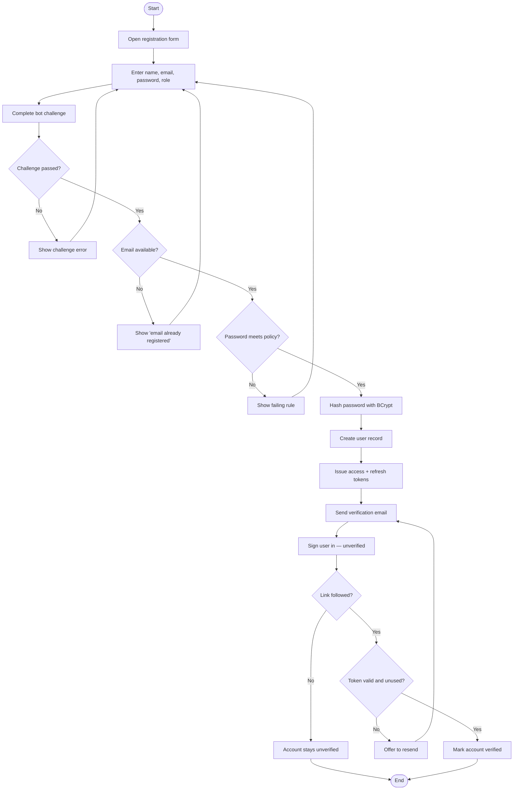

### 9.2 Booking negotiation (UC-04)

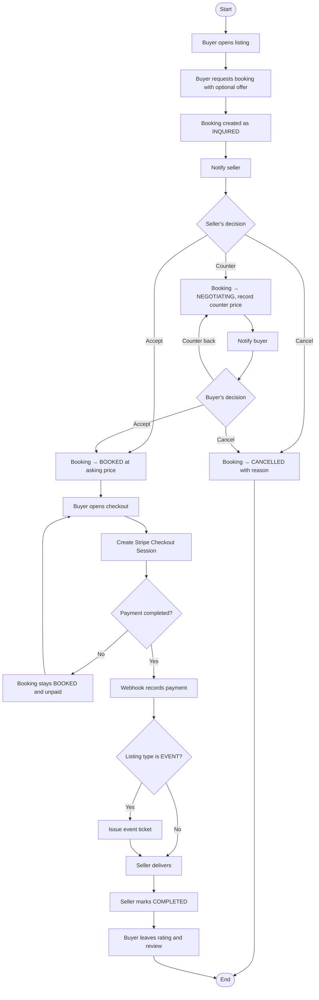

### 9.3 Bond swipe and match (UC-07)

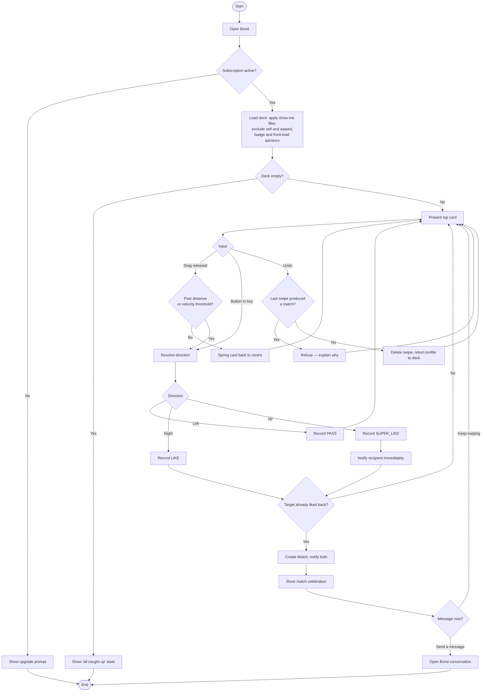

### 9.4 Door admission (UC-06)

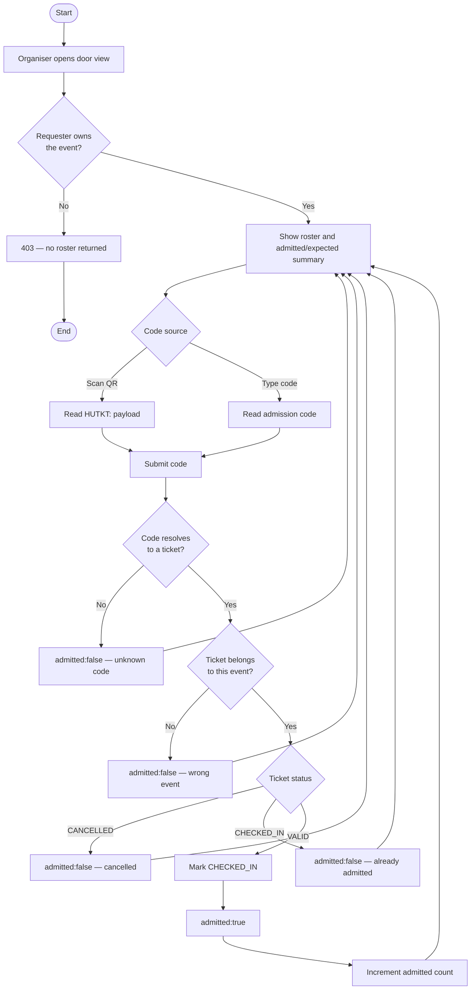

### 9.5 Session teardown (UC-10)

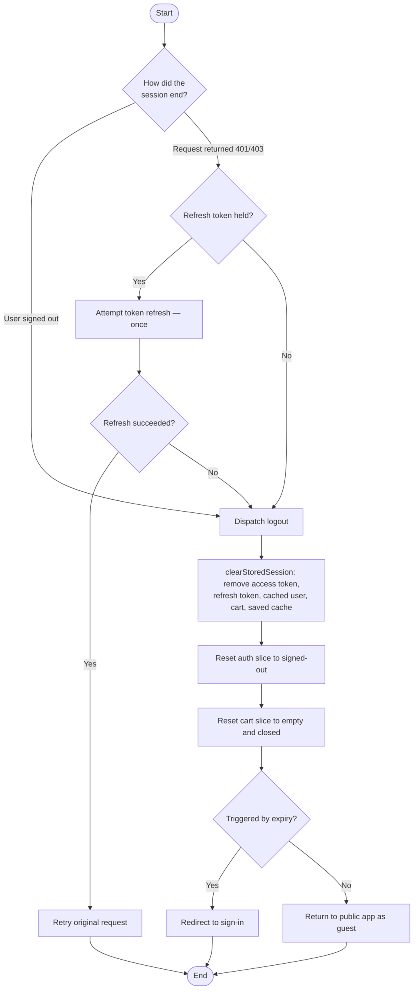

### 9.6 Direct message delivery (UC-08)

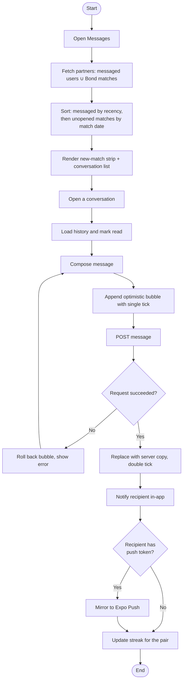

---

## 10. Domain state models

### 10.1 Booking lifecycle

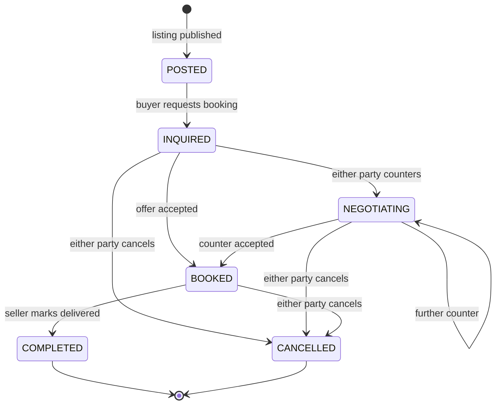

### 10.2 Event ticket lifecycle

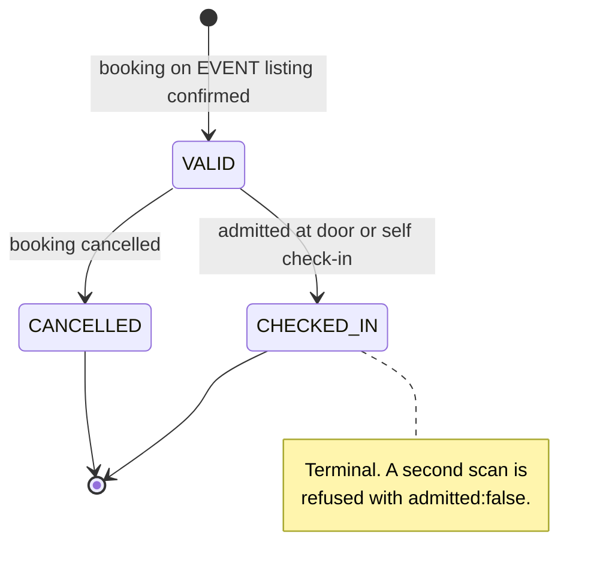

### 10.3 Swap offer lifecycle

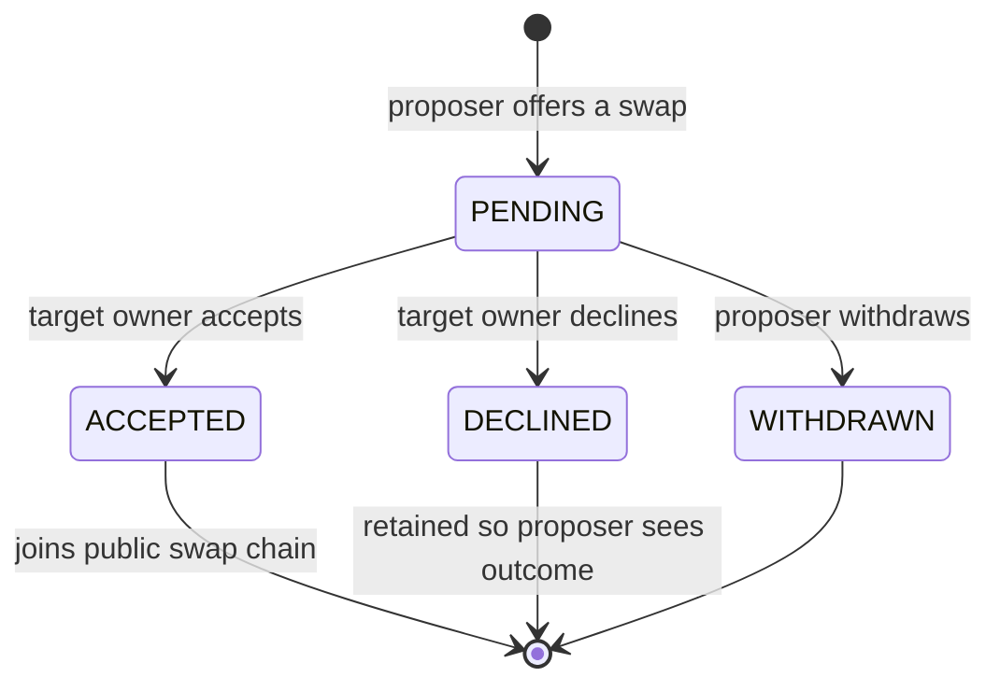

---

## 11. Test cases

**Status legend** — ✅ automated (executes in the build) · ⬜ specified, manual/not yet automated.

Current automated coverage is 18 backend unit tests across three suites: `AuthControllerTest` (2),
`DatingControllerTest` (11), `DirectMessageControllerTest` (5). There is no frontend test runner
configured; all frontend cases below are therefore manual.

### 11.1 Authentication

| ID | Requirement | Precondition | Steps | Expected result | Status |
|---|---|---|---|---|---|
| TC-AUTH-01 | FR-AUTH-01 | Email unused | Register with valid details | Account created; tokens returned; verification email sent | ⬜ |
| TC-AUTH-02 | FR-AUTH-01 | Email already registered | Register with the same email | Validation error naming the conflict; no second account | ✅ |
| TC-AUTH-03 | FR-AUTH-02 | Account exists | Inspect any API response containing a user | No password or hash field present | ⬜ |
| TC-AUTH-04 | FR-AUTH-04 | Verified account | Sign in with correct credentials | Access and refresh tokens issued | ✅ |
| TC-AUTH-05 | FR-AUTH-04 | Account exists | Sign in with wrong password | Generic failure that does not reveal whether the email exists | ⬜ |
| TC-AUTH-06 | FR-AUTH-06 | Access token expired, refresh valid | Issue any authenticated request | Token refreshed once transparently; original request succeeds | ⬜ |
| TC-AUTH-07 | FR-AUTH-06 | Refresh token invalid | Issue any authenticated request | Session cleared; redirect to sign-in; no infinite retry | ⬜ |
| TC-AUTH-08 | FR-AUTH-05 | — | Sign in with a forged provider token | Rejected — token is verified against the provider, not trusted | ⬜ |
| TC-AUTH-09 | FR-AUTH-07 | Registered email | Request reset, follow link, set new password | Old password rejected, new password accepted; token single-use | ⬜ |
| TC-AUTH-10 | NFR-SEC-05 | — | Send 10 login requests within one second | Requests beyond the 5th in the window are rate-limited | ⬜ |

### 11.2 Session teardown

| ID | Requirement | Precondition | Steps | Expected result | Status |
|---|---|---|---|---|---|
| TC-SESS-01 | FR-AUTH-09 | Signed in with 2 items in the cart | Sign out | Cart drawer empty; count 0 without a page reload | ⬜ |
| TC-SESS-02 | FR-AUTH-09 | As above | Sign out, then inspect `localStorage` | `hustleup_token`, `hustleup_refresh`, `hustleup_user`, `hustleup_cart`, `hustleup_saved` all absent | ⬜ |
| TC-SESS-03 | NFR-SEC-09 | User A signed out on a device | Sign in as user B on the same device | Cart empty; no saved listings from user A | ⬜ |
| TC-SESS-04 | NFR-REL-03 | Signed in, refresh token revoked | Trigger any request | Same teardown as an explicit sign-out, then redirect | ⬜ |
| TC-SESS-05 | FR-BOOK-11 | Guest with items in cart | Sign in | Cart is preserved — only sign-out clears it | ⬜ |

### 11.3 Listings and shops

| ID | Requirement | Precondition | Steps | Expected result | Status |
|---|---|---|---|---|---|
| TC-LIST-01 | FR-LIST-01 | Signed in as seller | Create one listing of each of the 8 types | All created and visible in browse | ⬜ |
| TC-LIST-02 | FR-LIST-05 | Listing is `ACTIVE` | Set it to `PAUSED`, then browse | Absent from browse; still on the seller dashboard | ⬜ |
| TC-LIST-03 | FR-LIST-03 | Not signed in | Browse and filter listings | Results returned; no authentication required | ⬜ |
| TC-LIST-04 | FR-LIST-06 | Signed in | Save a listing, sign out, sign in again | Saved set persists server-side | ⬜ |
| TC-LIST-05 | FR-LIST-08 / NFR-SEC-03 | Two sellers with shops | Seller A calls product-update on seller B's shop | 403; product unchanged | ⬜ |
| TC-LIST-06 | FR-LIST-07 | Seller has a shop | Fetch it by slug and by UUID | Both resolve to the same shop | ⬜ |
| TC-LIST-07 | NFR-USE-04 | Listing whose media URL is dead | Open the listing | Branded placeholder renders; no broken-image glyph | ⬜ |

### 11.4 Bookings and payment

| ID | Requirement | Precondition | Steps | Expected result | Status |
|---|---|---|---|---|---|
| TC-BOOK-01 | FR-BOOK-01, -02 | Active listing | Buyer requests a booking | Booking created as `INQUIRED`; seller notified | ⬜ |
| TC-BOOK-02 | FR-BOOK-03 | Booking `INQUIRED` | Seller counters | Status `NEGOTIATING`; counter price recorded | ⬜ |
| TC-BOOK-03 | FR-BOOK-03 | Booking `NEGOTIATING` | Both parties counter three more times | Status stays `NEGOTIATING`; latest price stands | ⬜ |
| TC-BOOK-04 | FR-BOOK-04 | Booking `NEGOTIATING` | Buyer accepts | Status `BOOKED` at the agreed price | ⬜ |
| TC-BOOK-05 | FR-BOOK-05 | Booking `BOOKED` | Seller cancels with a reason | Status `CANCELLED`; reason stored; no further transitions | ⬜ |
| TC-BOOK-06 | FR-BOOK-02 | Booking `COMPLETED` | Attempt to cancel | Rejected — `COMPLETED` is terminal | ⬜ |
| TC-BOOK-07 | FR-BOOK-07 | Booking `BOOKED` | Request checkout | Stripe-hosted URL returned for the agreed amount | ⬜ |
| TC-BOOK-08 | FR-BOOK-08 | Checkout abandoned | Return to the app manually | Booking still unpaid — the client's return is not treated as payment | ⬜ |
| TC-BOOK-09 | FR-BOOK-08 | Payment completed at Stripe | Deliver the webhook | Payment recorded; seller notified | ⬜ |
| TC-BOOK-10 | FR-BOOK-09 / NFR-SEC-08 | Seller onboarding payout | Complete Connect onboarding | Only account status stored; no bank details on platform servers | ⬜ |
| TC-BOOK-11 | FR-BOOK-10 | Booking `COMPLETED` | Buyer submits a review | Review stored; seller aggregate rating updates | ⬜ |

### 11.5 Event ticketing

| ID | Requirement | Precondition | Steps | Expected result | Status |
|---|---|---|---|---|---|
| TC-TICK-01 | FR-TICK-01 | Booking on an `EVENT` listing confirmed | Check the buyer's tickets | Exactly one `VALID` ticket issued | ⬜ |
| TC-TICK-02 | FR-TICK-01 | — | Attempt to create a ticket directly via the API | No such endpoint exists | ⬜ |
| TC-TICK-03 | FR-TICK-04 | `VALID` ticket, organiser at door | Scan the QR code | `admitted: true`; ticket becomes `CHECKED_IN` | ⬜ |
| TC-TICK-04 | FR-TICK-05 | Ticket already `CHECKED_IN` | Scan again | HTTP 200 with `admitted: false` and a reason — **not** an HTTP error | ⬜ |
| TC-TICK-05 | FR-TICK-04 | Ticket for a different event | Scan at this door | `admitted: false` — wrong event | ⬜ |
| TC-TICK-06 | FR-TICK-06 / NFR-SEC-03 | User who does not own the event | Request the roster, summary and scan endpoints | 403 on all three; no attendee data disclosed | ⬜ |
| TC-TICK-07 | FR-TICK-02 | `VALID` ticket | Enter the admission code by hand | Same outcome as scanning | ⬜ |
| TC-TICK-08 | FR-TICK-07 | `VALID` ticket, no door staff | Attendee self-admits | Ticket becomes `CHECKED_IN` | ⬜ |

### 11.6 Messaging

| ID | Requirement | Precondition | Steps | Expected result | Status |
|---|---|---|---|---|---|
| TC-MSG-01 | FR-MSG-07 | A match with zero messages | Fetch conversation partners | The match is present with `isNewMatch: true` and a `matchedAt` date | ✅ |
| TC-MSG-02 | FR-MSG-07 | A match that has been messaged | Fetch conversation partners | Appears exactly once, `isNewMatch: false`, with the message preview | ✅ |
| TC-MSG-03 | FR-MSG-06, -07 | One messaged chat, two matches of different ages | Fetch conversation partners | Messaged chat first; then the newer match; then the older | ✅ |
| TC-MSG-04 | FR-MSG-08 | Two users who matched | Query the bond-match endpoint | `isBondMatch: true` with the match date | ✅ |
| TC-MSG-05 | FR-MSG-08 | Two users who never matched | Query the bond-match endpoint | `isBondMatch: false` and no date field | ✅ |
| TC-MSG-06 | FR-MSG-04 | Unread messages in a conversation | Open it | Unread badge clears; total unread decreases by the same amount | ⬜ |
| TC-MSG-07 | NFR-REL-04 | Network offline | Send a message | Optimistic bubble appears then rolls back; error shown; no phantom message | ⬜ |
| TC-MSG-08 | FR-MSG-05 | Pair messaged yesterday | Message again today | Streak increments by one | ⬜ |
| TC-MSG-09 | FR-MSG-05 | Pair last messaged three days ago | Message today | Streak resets to 1 | ⬜ |
| TC-MSG-10 | FR-MSG-03 | Conversation open | Send image, sticker and shared listing | Each renders with its own preview in the conversation list | ⬜ |
| TC-MSG-11 | FR-MSG-08 | A Bond conversation and a marketplace conversation | View the list | Bond row is visually distinct — rose treatment and heart badge | ⬜ |

### 11.7 Hustle Bond

| ID | Requirement | Precondition | Steps | Expected result | Status |
|---|---|---|---|---|---|
| TC-BOND-01 | FR-BOND-01 | No active subscription | Open Bond | Upgrade prompt shown; no profiles returned | ⬜ |
| TC-BOND-02 | FR-BOND-12 | Viewer gender male, no preference saved | Load the deck | Only female profiles returned | ✅ |
| TC-BOND-03 | FR-BOND-12 | Viewer gender female, no preference saved | Load the deck | Only male profiles returned | ✅ |
| TC-BOND-04 | FR-BOND-12 | Viewer gender non-binary | Load the deck | All profiles returned, unfiltered | ✅ |
| TC-BOND-05 | FR-BOND-12 | Preference set to "Everyone" | Load the deck | Opposite-gender fallback does not apply; everyone returned | ✅ |
| TC-BOND-06 | FR-BOND-12 | Preference set to "Women" | Load the deck | Only female profiles; profiles with no stated gender excluded | ✅ |
| TC-BOND-07 | FR-BOND-11 | Someone has already liked the viewer | Load the deck | That profile is badged and appears first | ✅ |
| TC-BOND-08 | FR-BOND-08 | Target has not liked back | Send a super like | Swipe stored as `SUPER_LIKE`; target notified immediately | ✅ |
| TC-BOND-09 | FR-BOND-08 | Target has not liked back | Send an ordinary like | Swipe stored as `LIKE`; no notification raised | ✅ |
| TC-BOND-10 | FR-BOND-07 | Target already super liked the viewer | Viewer likes back | Match created — a super like counts as a like on both sides | ⬜ |
| TC-BOND-11 | FR-BOND-10 | Last swipe was a pass with no match | Undo | Swipe deleted; profile returned to the front of the deck | ✅ |
| TC-BOND-12 | FR-BOND-10 | Last swipe produced a match | Undo | Refused with reason `matched`; the swipe is not deleted | ✅ |
| TC-BOND-13 | FR-BOND-10 | No swipes ever made | Undo | Reported as `empty` — not an error | ✅ |
| TC-BOND-14 | FR-BOND-06 | Profile swiped, then page reloaded | Load the deck | The swiped profile does not reappear | ⬜ |
| TC-BOND-15 | FR-BOND-04 | Card on screen | Drag 40 px quickly and release | Swipe commits on velocity despite the short distance | ⬜ |
| TC-BOND-16 | FR-BOND-04 | Card on screen | Drag 60 px slowly and release | Card springs back to centre; no swipe recorded | ⬜ |
| TC-BOND-17 | FR-BOND-05 | Card on screen | Drag up past the threshold | `SUPER LIKE` indicator shown alone — not alongside `LIKE` | ⬜ |
| TC-BOND-18 | FR-BOND-09 | Mutual like occurs | Complete the swipe | Full-screen celebration with both avatars and a route into the conversation | ⬜ |
| TC-BOND-19 | FR-BOND-13 | Deck focused, no dialog open | Press ←, →, ↑ | Pass, like and super like respectively | ⬜ |
| TC-BOND-20 | FR-BOND-02 | Bond profile open | Select six interests | The sixth is refused; the limit is five | ⬜ |

### 11.8 Subscriptions

| ID | Requirement | Precondition | Steps | Expected result | Status |
|---|---|---|---|---|---|
| TC-SUB-01 | FR-SUB-02 | Plan `VERIFIED`, status `ACTIVE`, expiry future | Check access | Premium features available | ⬜ |
| TC-SUB-02 | FR-SUB-02 | Plan `VERIFIED`, expiry in the past | Check access | Treated as inactive; features re-gate | ⬜ |
| TC-SUB-03 | FR-SUB-02 | Plan `VERIFIED`, status `CANCELLED` | Check access | Treated as inactive | ⬜ |
| TC-SUB-04 | FR-SUB-03 | Free user | Complete the upgrade purchase | Subscription recorded; premium unlocks without re-authenticating | ⬜ |

### 11.9 Cross-cutting

| ID | Requirement | Precondition | Steps | Expected result | Status |
|---|---|---|---|---|---|
| TC-NFR-01 | NFR-USE-01 | — | View every page at 360 px, 768 px and 1440 px | No horizontal body scroll; wide tables scroll within their own container | ⬜ |
| TC-NFR-02 | NFR-USE-03 | OS reduced-motion enabled | Navigate the app | Spatial animations replaced by fades | ⬜ |
| TC-NFR-03 | NFR-USE-02 | — | Traverse the app by keyboard and screen reader | Every icon-only control announces a meaningful name | ⬜ |
| TC-NFR-04 | NFR-REL-01 | Notification store failing | Send a message | Message still sends and persists | ⬜ |
| TC-NFR-05 | NFR-REL-02 | Discovery query throws | Load the deck | Empty deck state rendered rather than a 500 | ⬜ |
| TC-NFR-06 | NFR-SEC-06 | — | Force a server error | Response carries no stack trace, internal path or PII | ⬜ |
| TC-NFR-07 | NFR-SEC-07 | — | Upload a file containing script content and open its URL | Served so it cannot execute as active content | ⬜ |
| TC-NFR-08 | NFR-PERF-01 | Bond deck open | Profile a drag in devtools | No component re-render per pointer move; sustained 60 fps | ⬜ |
| TC-NFR-09 | NFR-USE-07 | — | View any price | Formatted as Polish złoty | ⬜ |

---

## 12. Traceability matrix

Requirement → use case → test coverage. Only requirements with defined test cases are listed.

| Requirement | Use case | Test cases | Automated |
|---|---|---|---|
| FR-AUTH-01 | UC-01 | TC-AUTH-01, -02 | Partial |
| FR-AUTH-02 | UC-01 | TC-AUTH-03 | No |
| FR-AUTH-04 | UC-02 | TC-AUTH-04, -05 | Partial |
| FR-AUTH-05 | UC-02 | TC-AUTH-08 | No |
| FR-AUTH-06 | UC-02 | TC-AUTH-06, -07 | No |
| FR-AUTH-07 | UC-01 | TC-AUTH-09 | No |
| FR-AUTH-09 | UC-10 | TC-SESS-01 … -04 | No |
| FR-LIST-01, -05, -06 | UC-03 | TC-LIST-01 … -04 | No |
| FR-LIST-08 | UC-03 | TC-LIST-05 | No |
| FR-BOOK-01 … -06 | UC-04 | TC-BOOK-01 … -06 | No |
| FR-BOOK-07, -08 | UC-05 | TC-BOOK-07 … -09 | No |
| FR-BOOK-09 | UC-05 | TC-BOOK-10 | No |
| FR-BOOK-10 | UC-04 | TC-BOOK-11 | No |
| FR-TICK-01 … -07 | UC-06 | TC-TICK-01 … -08 | No |
| FR-MSG-03 … -08 | UC-08 | TC-MSG-01 … -11 | Partial |
| FR-BOND-01 | UC-07 | TC-BOND-01 | No |
| FR-BOND-04, -05 | UC-07 | TC-BOND-15 … -17 | No |
| FR-BOND-06 | UC-07 | TC-BOND-14 | No |
| FR-BOND-07, -08 | UC-07 | TC-BOND-08 … -10 | Partial |
| FR-BOND-09 | UC-07 | TC-BOND-18 | No |
| FR-BOND-10 | UC-07 | TC-BOND-11 … -13 | Yes |
| FR-BOND-11 | UC-07 | TC-BOND-07 | Yes |
| FR-BOND-12 | UC-07 | TC-BOND-02 … -06 | Yes |
| FR-SUB-02, -03 | UC-11 | TC-SUB-01 … -04 | No |
| NFR-SEC-03 | UC-06 | TC-LIST-05, TC-TICK-06 | No |
| NFR-SEC-05 | — | TC-AUTH-10 | No |
| NFR-SEC-09 | UC-10 | TC-SESS-02, -03 | No |
| NFR-REL-01, -02 | — | TC-NFR-04, -05 | No |
| NFR-USE-01 … -07 | — | TC-NFR-01 … -03, -09 | No |
| NFR-PERF-01 | UC-07 | TC-NFR-08 | No |

### Coverage gaps

The matrix makes three gaps explicit, listed in the order they are worth closing:

1. **The money path has no automated coverage at all.** Booking state transitions (FR-BOOK-02
   … -06) are pure business rules with several branches and terminal states — exactly the shape
   that unit tests catch regressions in — yet `hustleup-marketplace` has no test suite.
2. **Ticketing is untested despite being security-sensitive.** FR-TICK-05 and FR-TICK-06 —
   refusing a double admission and returning 403 to a non-owner — are the two rules that let a
   door be trusted.
3. **No frontend test runner is configured.** Every frontend requirement, including the whole of
   §11.2 session teardown, is manual-only.

---

## 13. Glossary

| Term | Meaning |
|---|---|
| **Bond** | Hustle Bond — the premium swipe-based matching feature |
| **Booking** | The negotiation-and-fulfilment record between a buyer and a seller against a listing |
| **Counter-offer** | A revised price proposed by either party during negotiation |
| **Deck** | The stack of discovery cards presented in Bond |
| **Listing** | Anything a seller offers: a service, product, event, rental or job |
| **Match** | A mutual like on Bond, which creates a conversation |
| **Shop** | A seller's storefront, holding products distinct from listings |
| **Slot** | A seller-published bookable time window |
| **Streak** | Consecutive days on which a pair of users exchanged messages |
| **Super like** | A Bond like that notifies the recipient immediately rather than staying private |
| **Swap** | A listing-for-listing trade between two sellers with no money involved |
| **Swap chain** | The public graph formed by accepted swap offers |
| **Verified** | The paid subscription plan; also the identity-verified badge on a profile |
